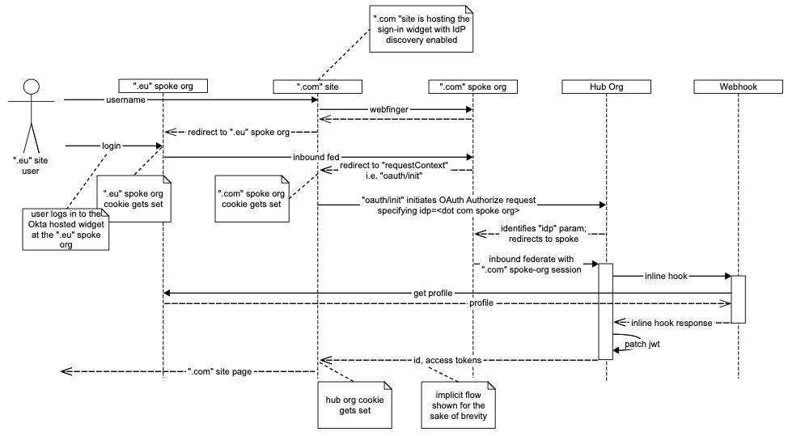

# hub-spoke-login-sample-vue

ℹ️ This is a fork of the Okta's official Vue sample code for custom-login. Head over [here](https://github.com/okta/samples-js-vue/tree/master/custom-login) to reference the original project.

## Introduction
For global companies, regulations require that EMEA / APAC  users' PII are stored in region. The most straightforward way to manage this requirement with Okta is to simply use multiple orgs from multiple regions. This however, leads to fragmented configuration, as Orgs are silo'd from each other. The challenge here is to avoid managing multiple Okta orgs.

### Hub & Spoke
In a Hub & Spoke arrangement, users are stored in multiple orgs. And there is one "central" org (aka the "Hub") where all the Apps, Policies, and Groups are managed. When people log in, they actually log into Okta where their user record is stored, but immediately fedarate into the Hub. From there, access policies kick in, Auth Servers mint tokens, and sessions are generated; And access to other applications are managed at the Hub.

### Login Implementation
This is sample code on how to implement seamless login from spoke to hub. The implementation details are captured in the sequence diagram below:

*This be below example, assume that there is some website hosted in EU. Users of this website are all stored in some subdomain.okta-emea.com Okta org (aka the "Spoke"). The Apps, Authorization Servers and Policies are configured at a different Okta Org, called the "Hub"*


#### Details:
1. The [/authn](https://developer.okta.com/docs/reference/api/authn/) endpoint returns a [sessionToken](https://developer.okta.com/docs/reference/api/authn/#session-token)
2. [Retrieve a session cookie by visiting a session redirect link](https://developer.okta.com/docs/guides/session-cookie/overview/#retrieving-a-session-cookie-by-visiting-a-session-redirect-link). Upon the redirect back to the SPA, the Okta session is set (for the Spoke org). 
    Steps 1 and 2 are implemented by the Okta Signin Widget; You'll see how this is implemented/configured this inside `/src/components/Login.vue`. Here's alittle code snippet:
    ```js
    this.widget.renderEl(
        { el: "#okta-signin-container" },
        res => {
            res.session.setCookieAndRedirect("http://localhost:8080/oauth/init");
        },
    ```
3. `/oauth/init` at the SPA will kick-off the OAuth2 [/authorize](https://developer.okta.com/docs/concepts/identity-providers/) request to the Hub. It provides the [idp](https://developer.okta.com/docs/reference/api/oidc/#request-parameters) parameter. This tells the Hub that the "idp" is the Spoke. 
    We'll use Okta's javascript library ([AuthJs](https://github.com/okta/okta-auth-js)) to do this: Inside `/src/components/Authorize.vue`
    ```js
    const authClient = AuthJs({
        issuer: config.oidc.issuer,
        clientId: config.oidc.clientId,
        redirectUri: config.oidc.redirectUri
    });
    authClient.token.getWithRedirect({
        scopes: config.oidc.scopes,
        idp: config.idp
    });
    ```
4. Because the Spoke already has a session (Step 2), the user will not be reprompted. The SSO into the Hub automatically occurs, the user is logged into the Hub and the Hub mints tokens for the app back at the OAuth2 callback handler. 

## Idp discovery
This sample also implements the Idp discovery use-case:


In `/src/components/Login.vue`
1. Set the `requestContext` to return to `/oauth/init`
    ```js
    idpDiscovery: {
        requestContext: "http://localhost:8080/oauth/init"
    }
    ```
2. Handle the IDP_DISCOVERY status:
    ```js
    res => {
        if (res.status === "IDP_DISCOVERY") {
            res.idpDiscovery.redirectToIdp(); 
    ```

---

## Setup
### A. Configure the Hub
At the Hub org:
1. Add an Application of type SPA:
    * Allowed grant types: **Authorization Code**
    * Login redirect URIs: **https://localhost:8080/oauth/callback**
    * Logout redirect URIs: **https://localhost:8080**
    * Client authentication: **Use PKCE**
2. Add an Authorization Server
    * Add a custom Authorization Server or use the `default`. We recommend using the default.

### B. Configure Org2Org
At the Spoke org:
1. Add the **Org2Org** application:
    * From the *Classic UI* console, navigate to **Applications > Applications**
    * Click [Add Application] 
    * In the search box, search for "Okta Org2Org"
    * Select the application
    * It is a SAML2 application. Step through the configuration wizard to finish configuring SAML to the Hub org. **TIP: Note that somewhere in this process, you will have to switch to the Hub org to configure inbound SAML from the Spoke, then switch back to the Spoke to complete the SAML config**
2. Add a trusted origin for the local environment:
    * (While still in *Classic UI*) Navigate to **Security > API > Trusted Origins**
    * Enable `CORS` and `Redirect` for **http://localhost:8080**


---

## Running the sample locally

Once you get the 2 Orgs setup out of the way:

1. Create a file `.env.local` (note the `.` in front of `env`) in the root of this project and populate these variables (note values are examples):
    ```
    VUE_APP_SPOKE_ORG=https://acme.oktapreview.com
    VUE_APP_IDP_ID=0zb9anxb7pR1Kuxo00h7
    VUE_APP_CLIENT_ID=0oanyipx0zHnZKubW0h7
    VUE_APP_ISSUER=https://hub.okta.com/oauth2/default
    ```

    Variables explanation:
    | Variable | Description | Example |
    | -------- | ----------- | ------- |
    | VUE_APP_SPOKE_ORG | org url of the spoke | https://acme.oktapreview.com
    | VUE_APP_IDP_ID | At the Hub, when you finish configuring Inbound SAML, you will see an "idp id" | 0zb9anxb7pR1Kuxo00h7 | 
    | VUE_APP_CLIENT_ID | client id of the SPA app configured at the Hub (from Step A .1) | 0oanyipx0zHnZKubW0h7 |
    | VUE_APP_ISSUER | issuer uri of the auth server (from Step A .2) | https://hub.okta.com/oauth2/default | 


2. ```npm install```

3. ```npm run serve```
